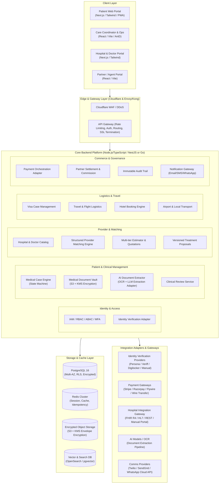

# GoHealthTrip — Production Architecture Specification

## 1. System Overview & Executive Summary

**GoHealthTrip** is a secure, scalable, multi-country medical travel coordination platform headquartered in India. The platform facilitates end-to-end medical tourism journeys for international patients seeking tertiary and quaternary care in accredited Indian hospitals (JCI, NABH). 

> [!IMPORTANT]
> **Clinical Boundary Disclaimer**: GoHealthTrip is strictly a healthcare facilitation, administrative coordination, and logistics management platform. It is **NOT** a medical diagnosis engine, telemedicine prescribing authority, or clinical decision maker. All medical evaluations, second opinions, treatment proposals, and surgical decisions are executed solely by registered medical practitioners (RMPs) and authorized clinical teams at partner healthcare institutions.

---

## 2. High-Level Architectural Topology

GoHealthTrip adopts a **Modular Clean Monolith Architecture** (Domain-Driven Design), structured with strong module isolation, ready to decompose into microservices as traffic scales across geographies.



---

## 3. Core Architectural Principles

1. **Strict Hexagonal / Clean Architecture (Ports & Adapters)**:
   - All third-party providers (Identity Verification, Payments, Hospital EMRs, Document OCR/LLMs, Visa, Hotel, Transport, SMS/WhatsApp) sit strictly behind abstract interface boundaries (ports).
   - Core domain logic never depends on external vendor SDKs or implementations.
2. **Configuration-Driven Multi-Country Engine**:
   - Every nation has a localized config profile: accepted identity documents, currency, tax rules, medical visa (M-Visa / MVX) requirements, attendant rules, language, phone patterns, and compliance regulations.
   - Zero hardcoding of country-specific logic.
3. **Defense-in-Depth & Privacy by Design**:
   - End-to-end encryption in transit (TLS 1.3) and at rest (AES-256 with AWS KMS envelope encryption).
   - Row-Level Security (RLS) and Attribute-Based Access Control (ABAC) preventing cross-tenant or cross-patient data exposure (Strict IDOR prevention).
   - Pre-signed, time-limited single-use URLs for all medical and identity documents.
4. **Deterministic State Machine**:
   - The lifecycle of a `MedicalCase`, `TreatmentProposal`, `VisaCase`, and `PaymentTransaction` is governed by formal deterministic finite state machines (FSM) with strict transition guards and immutable audit logging.
5. **Idempotency & Resilience**:
   - All mutating API calls (payments, case submission, booking requests, hospital sync) require client-supplied `Idempotency-Key` headers backed by Redis distributed locks.
6. **Regulatory Compliance Alignment**:
   - Designed to comply with India's **Digital Personal Data Protection Act (DPDP 2023)**, **National Digital Health Mission (ABDM / ABDM Ayushman Bharat Digital Mission)**, **HIPAA Security Rule principles**, and **NABH/MCI guidelines** for medical facilitation.

---

## 4. Integration Architecture

Every external dependency implements a strict contract:

| Subsystem | Port Interface | Concrete Adapters (Production & Mock) |
|---|---|---|
| **Identity Verification** | `IIdentityVerificationProvider` | `PersonaAdapter`, `VeriffAdapter`, `ManualVerificationAdapter`, `MockIdentityAdapter` |
| **Payments** | `IPaymentProvider` | `RazorpayInternationalAdapter`, `StripeAdapter`, `FlywireAdapter`, `OfflineWireAdapter`, `MockPaymentAdapter` |
| **Hospital Integrations** | `IHospitalIntegrationProvider` | `FhirR4HospitalAdapter`, `RestJsonHospitalAdapter`, `ManualPortalAdapter`, `MockHospitalAdapter` |
| **AI Document Extraction** | `IAIDocumentExtractor` | `ClaudeMedicalDocExtractor`, `OpenAIMedicalDocExtractor`, `TesseractTextExtractor`, `MockAIExtractor` |
| **Notifications** | `INotificationProvider` | `SendGridEmailAdapter`, `TwilioSmsAdapter`, `WhatsAppCloudAdapter`, `MockNotificationAdapter` |
| **Storage** | `IObjectStorageProvider` | `AwsS3StorageAdapter`, `MinioStorageAdapter`, `LocalStorageAdapter` |

---

## 5. Security Architecture & Threat Model

```mermaid
flowchart LR
    subgraph Untrusted["Internet / Untrusted Zone"]
        P[Patient]
        C[Care Coordinator]
        D[Doctor / Hospital]
    end

    subgraph EdgeSec["Edge Security"]
        WAF[Cloudflare WAF / DDoS / Bot Shield]
        TLS[TLS 1.3 Termination / HSTS]
    end

    subgraph AuthZ["Zero-Trust API Gateway"]
        JWT[JWT Verification & Session Validation]
        MFA[TOTP / SMS MFA Enforcer]
        RL[Rate Limiting (IP + User)]
        ABAC[ABAC / Tenant / Object-Level ACL]
    end

    subgraph AppSec["Application & Data Security"]
        SAN[Input Sanitization & Schema Validation]
        KMS[AWS KMS Envelope Key Management]
        SCAN[ClamAV Anti-Malware File Scanner]
        AUDIT[Tamper-Proof Audit Logger]
        PII[PII / PHI Redaction Engine]
    end

    Untrusted --> EdgeSec --> AuthZ --> AppSec
```

- **IDOR Safeguards**: Direct database access requires verification of the caller's contextual tenant/patient association before returning any entity.
- **Audit Logging**: Every access to PHI (Protected Health Information) and PII (Personally Identifiable Information) records an immutable log with `user_id`, `patient_id`, `document_id`, `ip_address`, `timestamp`, `action`, `resource`, and `access_reason`.
- **Anti-Malware**: Uploaded files pass through an asynchronous ClamAV scanning queue before becoming accessible to clinical reviewers or care coordinators.
