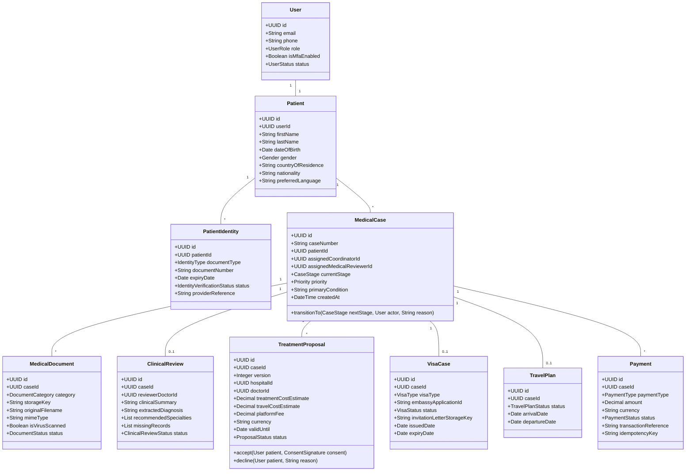

# Domain Model & Ubiquitous Language — GoHealthTrip

## 1. Ubiquitous Language & Core Terminology

- **Patient**: An international citizen seeking medical treatment in India.
- **Companion / Attendant**: A family member or caregiver authorized to travel with the patient on a Medical Attendant Visa (MED-X).
- **Medical Case**: The central aggregate root representing the patient's single clinical objective or treatment episode.
- **Clinical Review**: An internal clinical evaluation performed by a medical reviewer to sanitize, categorize, and specify provider matching criteria.
- **Provider**: Either an accredited Hospital or a credentialed Specialist Doctor practicing in India.
- **Preliminary Estimate**: An indicative, non-binding cost and duration estimate generated by the platform matching engine or care team.
- **Hospital Quotation / Estimate**: A formal, signed cost estimate provided directly by the partner hospital's International Patient Desk.
- **Treatment Proposal**: A versioned, legally binding package presented to the patient containing hospital quote, doctor bio, duration, inclusions, exclusions, and logistics estimate.
- **Visa Invitation Letter (VIL)**: A formal letter issued on hospital letterhead required by Indian Embassies / e-Visa portal for granting Medical (MED) and Medical Attendant (MED-X) visas.
- **Travel Itinerary**: The combined logistics blueprint consisting of flights, airport transit, local accommodation, and hospital appointment schedules.
- **Treatment Episode**: The in-hospital admission, surgical or therapeutic procedures, inpatient stay, discharge summary, and initial recovery.
- **Follow-Up**: Post-discharge and post-return remote clinical check-ins with the treating doctor in India.

---

## 2. Aggregate Roots & Entity Relationships

---

## 3. Domain Events

1. `PatientRegisteredEvent`
2. `IdentityVerificationSubmittedEvent` & `IdentityVerificationCompletedEvent`
3. `MedicalDocumentUploadedEvent` & `MedicalDocumentScanPassedEvent`
4. `AIDocumentExtractionCompletedEvent`
5. `ClinicalReviewCompletedEvent`
6. `ProviderDossierSharedEvent`
7. `HospitalEstimateReceivedEvent`
8. `TreatmentProposalIssuedEvent`
9. `TreatmentProposalAcceptedEvent` & `TreatmentProposalDeclinedEvent`
10. `PaymentAuthorizedEvent` & `PaymentCapturedEvent`
11. `VisaInvitationLetterGeneratedEvent`
12. `VisaApprovedEvent`
13. `TravelItineraryFinalizedEvent`
14. `PatientArrivedInIndiaEvent`
15. `HospitalAdmissionRecordedEvent`
16. `PatientDischargedEvent`
17. `PostTreatmentFollowUpScheduledEvent`
18. `CaseClosedEvent`
