# Database Schema & Entity Relationship Diagram (ERD) — GoHealthTrip

## 1. Database Overview

- **Engine**: PostgreSQL 16+
- **Security & Privacy**: Row-Level Security (RLS) policies per patient tenant, Column-level encryption (pgcrypto/KMS envelope) for sensitive identity numbers, UUIDv7 / UUIDv4 primary keys for distributed predictability without sequence enumeration.
- **Auditability**: Triggers / Event-sourcing capturing all row mutations into `audit_logs`.

---

## 2. Mermaid Entity Relationship Diagram

```mermaid
erDiagram
    USERS ||--o{ PATIENTS : "has"
    USERS ||--o{ USER_ROLES : "assigned"
    ROLES ||--o{ USER_ROLES : "belongs_to"
    ROLES ||--o{ ROLE_PERMISSIONS : "has"
    PERMISSIONS ||--o{ ROLE_PERMISSIONS : "grants"

    PATIENTS ||--o{ PATIENT_IDENTITIES : "verifies"
    PATIENTS ||--o{ PATIENT_COMPANIONS : "accompanied_by"
    PATIENTS ||--o{ MEDICAL_CASES : "owns"

    COUNTRIES ||--o{ COUNTRY_CONFIGURATIONS : "configures"
    COUNTRIES ||--o{ PATIENTS : "originates_from"
    COUNTRIES ||--o{ HOSPITALS : "located_in"

    HOSPITALS ||--o{ HOSPITAL_DEPARTMENTS : "contains"
    HOSPITALS ||--o{ HOSPITAL_DOCTORS : "employs"
    DOCTORS ||--o{ HOSPITAL_DOCTORS : "associates"
    HOSPITAL_DEPARTMENTS ||--o{ TREATMENTS : "offers"
    TREATMENTS ||--o{ PROCEDURES : "comprises"

    MEDICAL_CASES ||--o{ MEDICAL_DOCUMENTS : "includes"
    MEDICAL_DOCUMENTS ||--o{ MEDICAL_DOCUMENT_VERSIONS : "versions"
    MEDICAL_CASES ||--o{ CLINICAL_REVIEWS : "reviewed_by"
    MEDICAL_CASES ||--o{ TREATMENT_ESTIMATES : "receives"
    MEDICAL_CASES ||--o{ TREATMENT_PROPOSALS : "generates"
    MEDICAL_CASES ||--o{ APPOINTMENTS : "schedules"
    MEDICAL_CASES ||--o{ VISA_CASES : "requires"
    VISA_CASES ||--o{ VISA_DOCUMENTS : "contains"
    MEDICAL_CASES ||--o{ TRAVEL_PLANS : "coordinates"
    TRAVEL_PLANS ||--o{ FLIGHTS : "includes"
    TRAVEL_PLANS ||--o{ HOTEL_BOOKINGS : "books"
    TRAVEL_PLANS ||--o{ TRANSPORT_BOOKINGS : "transports"

    MEDICAL_CASES ||--o{ HOSPITAL_ADMISSIONS : "admits"
    HOSPITAL_ADMISSIONS ||--o{ TREATMENT_EPISODES : "performs"
    TREATMENT_EPISODES ||--o{ DISCHARGES : "concludes"
    DISCHARGES ||--o{ FOLLOW_UPS : "tracks"

    MEDICAL_CASES ||--o{ PAYMENTS : "billed_via"
    PAYMENTS ||--o{ INVOICES : "documents"
    PAYMENTS ||--o{ REFUNDS : "reverses"

    PARTNERS ||--o{ REFERRAL_AGREEMENTS : "contracts"
    REFERRAL_AGREEMENTS ||--o{ REFERRAL_TRANSACTIONS : "credits"
    MEDICAL_CASES ||--o{ REFERRAL_TRANSACTIONS : "attributed_to"

    USERS ||--o{ SUPPORT_TICKETS : "submits"
    MEDICAL_CASES ||--o{ SUPPORT_TICKETS : "references"
    USERS ||--o{ MESSAGES : "sends"
    MEDICAL_CASES ||--o{ MESSAGES : "discusses"
    USERS ||--o{ NOTIFICATIONS : "receives"
    USERS ||--o{ CONSENTS : "executes"
    USERS ||--o{ AUDIT_LOGS : "causes"
```

---

## 3. Core Database Table Definitions

### 3.1 Identity & Access Control
- `users`: `(id UUID PK, email VARCHAR UNIQUE, phone VARCHAR, password_hash VARCHAR, is_mfa_enabled BOOLEAN, mfa_secret_encrypted VARCHAR, status ENUM, created_at TIMESTAMPTZ, updated_at TIMESTAMPTZ, deleted_at TIMESTAMPTZ)`
- `roles`: `(id UUID PK, name VARCHAR UNIQUE, description TEXT, is_system_role BOOLEAN)`
- `permissions`: `(id UUID PK, code VARCHAR UNIQUE, module VARCHAR, description TEXT)`
- `user_roles`: `(id UUID PK, user_id UUID FK, role_id UUID FK, assigned_at TIMESTAMPTZ)`
- `role_permissions`: `(id UUID PK, role_id UUID FK, permission_id UUID FK)`

### 3.2 Country & Regional Configuration
- `countries`: `(id UUID PK, code VARCHAR(3) UNIQUE, name VARCHAR, phone_prefix VARCHAR, flag_icon_url VARCHAR, is_active BOOLEAN)`
- `languages`: `(id UUID PK, code VARCHAR(5) UNIQUE, name VARCHAR, native_name VARCHAR, is_rtl BOOLEAN)`
- `country_configurations`: `(id UUID PK, country_id UUID FK UNIQUE, config_json JSONB, created_at TIMESTAMPTZ, updated_at TIMESTAMPTZ)`

### 3.3 Patient Profile & Identity
- `patients`: `(id UUID PK, user_id UUID FK UNIQUE, first_name VARCHAR, last_name VARCHAR, date_of_birth DATE, gender ENUM, nationality_country_id UUID FK, residence_country_id UUID FK, primary_language_id UUID FK, emergency_contact_json JSONB, created_at TIMESTAMPTZ, updated_at TIMESTAMPTZ)`
- `patient_identities`: `(id UUID PK, patient_id UUID FK, document_type ENUM, document_number_hash VARCHAR, document_number_encrypted VARCHAR, expiry_date DATE, verification_provider VARCHAR, status ENUM, provider_payload_json JSONB, verified_at TIMESTAMPTZ)`
- `patient_companions`: `(id UUID PK, patient_id UUID FK, first_name VARCHAR, last_name VARCHAR, relationship ENUM, passport_number_encrypted VARCHAR, nationality_country_id UUID FK, requires_attendant_visa BOOLEAN)`

### 3.4 Medical Case & Document Management
- `medical_cases`: `(id UUID PK, case_number VARCHAR UNIQUE, patient_id UUID FK, assigned_coordinator_id UUID FK, assigned_medical_reviewer_id UUID FK, current_stage ENUM, priority ENUM, primary_condition VARCHAR, description TEXT, preferred_location VARCHAR, budget_range_usd NUMRANGE, created_at TIMESTAMPTZ, updated_at TIMESTAMPTZ)`
- `medical_documents`: `(id UUID PK, case_id UUID FK, patient_id UUID FK, category ENUM, original_filename VARCHAR, mime_type VARCHAR, file_size_bytes BIGINT, storage_key VARCHAR, is_virus_scanned BOOLEAN, scan_result ENUM, status ENUM, created_at TIMESTAMPTZ)`
- `medical_document_versions`: `(id UUID PK, document_id UUID FK, version_number INT, storage_key VARCHAR, uploaded_by_user_id UUID FK, change_summary TEXT, created_at TIMESTAMPTZ)`
- `ai_document_extractions`: `(id UUID PK, document_id UUID FK, case_id UUID FK, model_name VARCHAR, extracted_data_json JSONB, missing_fields_json JSONB, confidence_score DECIMAL, is_human_reviewed BOOLEAN, reviewed_by_user_id UUID FK, created_at TIMESTAMPTZ)`
- `clinical_reviews`: `(id UUID PK, case_id UUID FK, reviewer_doctor_id UUID FK, clinical_summary TEXT, extracted_diagnosis TEXT, recommended_specialties JSONB, missing_records JSONB, risk_flags JSONB, review_status ENUM, submitted_at TIMESTAMPTZ)`

### 3.5 Providers, Catalogs, Estimations & Proposals
- `hospitals`: `(id UUID PK, name VARCHAR, slug VARCHAR UNIQUE, country_id UUID FK, city VARCHAR, address TEXT, accreditations JSONB, international_desk_email VARCHAR, integration_type ENUM, is_active BOOLEAN)`
- `doctors`: `(id UUID PK, user_id UUID FK, first_name VARCHAR, last_name VARCHAR, qualification VARCHAR, primary_specialty VARCHAR, experience_years INT, bio TEXT, languages_spoken JSONB, is_active BOOLEAN)`
- `hospital_doctors`: `(id UUID PK, hospital_id UUID FK, doctor_id UUID FK, department_id UUID FK, consultation_fee DECIMAL, is_active BOOLEAN)`
- `treatments`: `(id UUID PK, code VARCHAR UNIQUE, name VARCHAR, specialty VARCHAR, typical_stay_days INT, typical_recovery_days INT, description TEXT)`
- `treatment_estimates`: `(id UUID PK, case_id UUID FK, hospital_id UUID FK, doctor_id UUID FK, estimate_type ENUM, treatment_cost DECIMAL, doctor_fee DECIMAL, room_and_nursing DECIMAL, diagnostics_cost DECIMAL, additional_costs DECIMAL, currency VARCHAR(3), inclusions JSONB, exclusions JSONB, assumptions JSONB, valid_until DATE, version INT, status ENUM)`
- `treatment_proposals`: `(id UUID PK, case_id UUID FK, version INT, hospital_id UUID FK, doctor_id UUID FK, treatment_estimate_id UUID FK, treatment_cost_usd DECIMAL, logistics_cost_usd DECIMAL, platform_fee_usd DECIMAL, total_usd DECIMAL, estimated_admission_date DATE, estimated_stay_days INT, terms_and_conditions TEXT, valid_until DATE, status ENUM, accepted_at TIMESTAMPTZ, declined_reason TEXT)`

### 3.6 Visa, Travel & Logistics
- `visa_cases`: `(id UUID PK, case_id UUID FK, visa_type ENUM, embassy_reference_number VARCHAR, invitation_letter_storage_key VARCHAR, status ENUM, application_date DATE, issue_date DATE, expiry_date DATE, frro_registration_required BOOLEAN)`
- `travel_plans`: `(id UUID PK, case_id UUID FK, arrival_date DATE, departure_date DATE, status ENUM, master_itinerary_json JSONB)`
- `flights`: `(id UUID PK, travel_plan_id UUID FK, airline VARCHAR, flight_number VARCHAR, departure_airport VARCHAR(3), arrival_airport VARCHAR(3), departure_time TIMESTAMPTZ, arrival_time TIMESTAMPTZ, pnr_number VARCHAR)`
- `hotels`: `(id UUID PK, name VARCHAR, city VARCHAR, address TEXT, distance_to_hospital_km DECIMAL, wheelchair_accessible BOOLEAN, star_rating INT)`
- `hotel_bookings`: `(id UUID PK, travel_plan_id UUID FK, hotel_id UUID FK, check_in_date DATE, check_out_date DATE, room_type VARCHAR, booking_reference VARCHAR, status ENUM)`
- `transport_bookings`: `(id UUID PK, travel_plan_id UUID FK, transport_type ENUM, pickup_location TEXT, dropoff_location TEXT, scheduled_time TIMESTAMPTZ, driver_name VARCHAR, driver_phone VARCHAR, vehicle_number VARCHAR, status ENUM)`

### 3.7 Hospital Episode & Follow-Up
- `hospital_admissions`: `(id UUID PK, case_id UUID FK, hospital_id UUID FK, doctor_id UUID FK, admission_date DATE, room_number VARCHAR, admission_status ENUM)`
- `treatment_episodes`: `(id UUID PK, admission_id UUID FK, procedure_date DATE, procedure_name VARCHAR, treating_surgeon_id UUID FK, operative_notes_summary TEXT, complication_flags BOOLEAN)`
- `discharges`: `(id UUID PK, admission_id UUID FK, discharge_date DATE, discharge_summary_storage_key VARCHAR, medications_prescribed JSONB, post_care_instructions TEXT)`
- `follow_ups`: `(id UUID PK, case_id UUID FK, scheduled_date DATE, doctor_id UUID FK, consultation_mode ENUM, notes TEXT, status ENUM)`

### 3.8 Payments, Consents & Audit Logs
- `payments`: `(id UUID PK, case_id UUID FK, payment_category ENUM, amount DECIMAL, currency VARCHAR(3), payment_provider VARCHAR, transaction_ref VARCHAR UNIQUE, idempotency_key VARCHAR UNIQUE, status ENUM, initiated_at TIMESTAMPTZ, completed_at TIMESTAMPTZ)`
- `consents`: `(id UUID PK, user_id UUID FK, case_id UUID FK, consent_type ENUM, version VARCHAR, ip_address VARCHAR, user_agent TEXT, signed_at TIMESTAMPTZ)`
- `audit_logs`: `(id UUID PK, entity_name VARCHAR, entity_id UUID, user_id UUID FK, action ENUM, old_values JSONB, new_values JSONB, ip_address VARCHAR, user_agent TEXT, timestamp TIMESTAMPTZ)`
