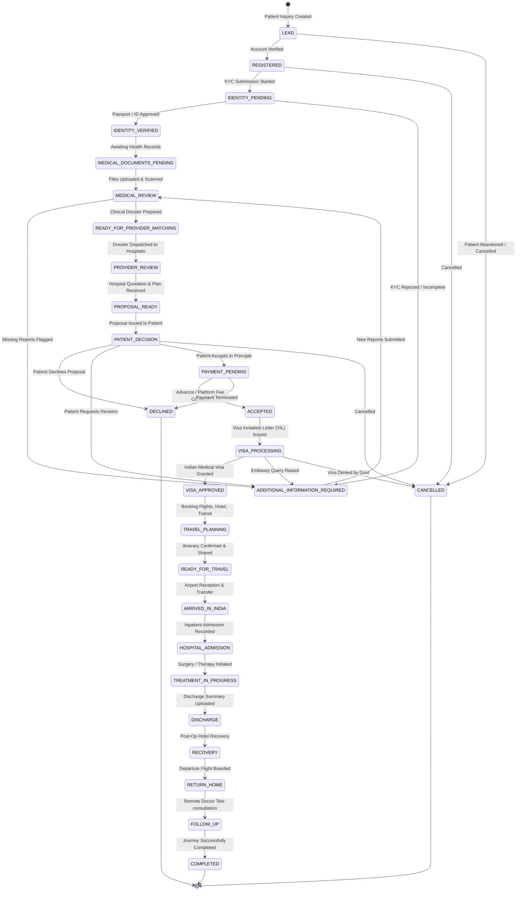

# Medical Case State Machine Specification — GoHealthTrip

## 1. Overview & Core Invariants

The `MedicalCase` lifecycle is governed by an immutable finite state machine comprising 28 distinct stages. 

### Core State Machine Invariants:
1. **Zero Backward Leaps Without Audit**: Reverting a case stage (e.g. from `PROPOSAL_READY` back to `ADDITIONAL_INFORMATION_REQUIRED`) requires an explicit coordinator override with a mandatory audit reason.
2. **Deterministic Guard Validation**: State transitions cannot execute unless all prerequisite entity conditions are satisfied (e.g., cannot enter `VISA_PROCESSING` without an `ACCEPTED` proposal and verified KYC).
3. **Automated Side-Effects**: State transitions automatically emit domain events, notify relevant actors, update timeline projections, and record an immutable `audit_log`.

---

## 2. State Machine Transition Diagram

---

## 3. Detailed Transition Table & Guards

| Current Stage | Allowed Next Stage | Actor Permitted | Guard Condition / Prerequisite |
|---|---|---|---|
| `LEAD` | `REGISTERED`, `CANCELLED` | Patient / Coordinator | Valid email/phone verification. |
| `REGISTERED` | `IDENTITY_PENDING` | Patient | Identity verification initiated with provider. |
| `IDENTITY_PENDING` | `IDENTITY_VERIFIED`, `ADDITIONAL_INFORMATION_REQUIRED` | Identity Provider / Coordinator | Provider webhook `VERIFIED` or manual coordinator override. |
| `IDENTITY_VERIFIED` | `MEDICAL_DOCUMENTS_PENDING` | System | Auto-transition upon KYC completion. |
| `MEDICAL_DOCUMENTS_PENDING` | `MEDICAL_REVIEW` | Patient / Coordinator | At least 1 valid, virus-scanned medical document uploaded. |
| `MEDICAL_REVIEW` | `READY_FOR_PROVIDER_MATCHING`, `ADDITIONAL_INFORMATION_REQUIRED` | Medical Reviewer | Clinical Review record saved with ICD-10 tags & recommendations. |
| `READY_FOR_PROVIDER_MATCHING` | `PROVIDER_REVIEW` | Care Coordinator | Provider matching run; at least 1 hospital dossier dispatched. |
| `PROVIDER_REVIEW` | `PROPOSAL_READY` | Hospital Desk / Coordinator | Formal hospital quotation & estimate received. |
| `PROPOSAL_READY` | `PATIENT_DECISION` | Care Coordinator | Versioned `TreatmentProposal` published to patient. |
| `PATIENT_DECISION` | `PAYMENT_PENDING`, `DECLINED`, `ADDITIONAL_INFORMATION_REQUIRED` | Patient | Patient digital consent or explicit decline reason. |
| `PAYMENT_PENDING` | `ACCEPTED`, `DECLINED` | Payment Gateway / Finance | Payment webhook received with `status: CAPTURED`. |
| `ACCEPTED` | `VISA_PROCESSING` | Visa Coordinator | Hospital VIL letter generated and uploaded. |
| `VISA_PROCESSING` | `VISA_APPROVED`, `ADDITIONAL_INFORMATION_REQUIRED`, `CANCELLED` | Visa Coordinator | Valid Indian e-Medical Visa copy uploaded and verified. |
| `VISA_APPROVED` | `TRAVEL_PLANNING` | Travel Coordinator | Flight & hotel coordination initialized. |
| `TRAVEL_PLANNING` | `READY_FOR_TRAVEL` | Travel Coordinator | Flight confirmed, hotel booked, airport driver assigned. |
| `READY_FOR_TRAVEL` | `ARRIVED_IN_INDIA` | Transport / Coordinator | Airport pickup completed by transport partner. |
| `ARRIVED_IN_INDIA` | `HOSPITAL_ADMISSION` | Hospital IPD Desk | Patient admitted; room and admission number assigned. |
| `HOSPITAL_ADMISSION` | `TREATMENT_IN_PROGRESS` | Treating Doctor / IPD | Clinical procedure commenced. |
| `TREATMENT_IN_PROGRESS` | `DISCHARGE` | Treating Doctor / IPD | Procedure concluded; discharge summary uploaded. |
| `DISCHARGE` | `RECOVERY` | Care Coordinator | Patient checked into recovery hotel. |
| `RECOVERY` | `RETURN_HOME` | Travel Coordinator | Airport drop completed and flight departed. |
| `RETURN_HOME` | `FOLLOW_UP` | Care Coordinator | Post-travel status active; follow-up scheduled. |
| `FOLLOW_UP` | `COMPLETED` | Care Coordinator / Patient | Follow-up tele-consult completed; feedback captured. |
| Any Active Stage | `CANCELLED` | Coordinator / Admin | Mandatory cancellation reason logged in audit trail. |
