# Project Roadmap & Repository Structure — GoHealthTrip

## 1. Recommended Repository Architecture

We adopt a modular, production-ready Monorepo architecture (using Turborepo / pnpm workspaces):

```text
GoHealthTrip/
├── apps/
│   ├── patient-web/                # Next.js 15 (App Router), TailwindCSS, Multilingual (i18n), PWA
│   ├── ops-portal/                 # React 19 / Vite, Ant Design / Tailwind, Command Center for Coordinators & Admins
│   ├── hospital-portal/            # Next.js 15, Hospital IPD Desk & Doctor Workspace
│   └── api-server/                 # Node.js / NestJS (TypeScript), Modular Architecture, OpenAPI Swagger
├── packages/
│   ├── core-domain/                # Pure TypeScript domain models, state machines, validation rules (Zod)
│   ├── database/                   # Prisma / Drizzle ORM schema, PostgreSQL migrations, DEMO seed scripts
│   ├── adapters/                   # Hexagonal port implementations:
│   │   ├── identity-verification/  # Persona, Veriff, Manual, Mock
│   │   ├── payment-gateways/       # Razorpay, Stripe, Flywire, Mock
│   │   ├── hospital-integration/   # FHIR R4, REST, Manual, Mock
│   │   ├── ai-document-extract/    # Document OCR + LLM Extractor, Mock
│   │   ├── storage/                # AWS S3 KMS, MinIO, Local
│   │   └── notifications/          # SendGrid, Twilio, WhatsApp, Mock
│   ├── ui-kit/                     # Shared Tailwind / Radix UI components (accessible, healthcare-grade theme)
│   └── config/                     # Country configuration catalog, ESLint, TypeScript configs
├── docs/                           # Architectural, PRD, ERD, Security and API documentation
└── infrastructure/                 # Docker Compose, Terraform, Kubernetes manifests, CI/CD GitHub Actions
```

---

## 2. Phased Implementation Roadmap

```mermaid
flowchart TD
    subgraph MVP["MVP (Phase 1) — Core Coordination Engine"]
        M1["Database Layer & DEMO Seeds"]
        M2["Central MedicalCase State Machine"]
        M3["Patient Web Onboarding & Vault"]
        M4["Care Coordinator Command Center"]
        M5["AI Document Extraction (Mock/Sandbox)"]
        M6["Structured Provider Matching"]
        M7["Multi-tier Estimates & Proposals"]
        M8["Mock Adapters (IDV, Pay, Hosp, Comms)"]
        M9["Automated Test Suite (End-to-End)"]
    end

    subgraph P2["Phase 2 — Advanced Integrations & Logistics"]
        P2_1["Live Visa Tracking & FRRO Registry"]
        P2_2["Full Travel, Hotel & Transport Booking Suite"]
        P2_3["Hospital IPD & Doctor Portals"]
        P2_4["Production Payment Gateways (Stripe/Razorpay)"]
        P2_5["WhatsApp Cloud API Two-Way Messaging"]
        P2_6["Live OCR & LLM Document Pipeline"]
    end

    subgraph P3["Phase 3 — Enterprise Scale & Federation"]
        P3_1["Hospital FHIR R4 / HL7 Bi-directional Sync"]
        P3_2["B2B Global Referral Partner Settlement"]
        P3_3["Multi-lingual Live Tele-Consultations"]
        P3_4["India ABDM (Ayushman Bharat Digital Mission) Gateway"]
        P3_5["Automated Dynamic Pricing & Predictive Scheduling"]
    end

    MVP --> P2 --> P3
```



---

## 3. Scope Breakdown

### 3.1 MVP Scope (Immediate Deliverable)
- Complete PostgreSQL schema with migrations and rich, realistic DEMO seed data (Hospitals, Doctors, Specialties, Countries, Packages).
- Central state machine enforcing all 28 stages with audit logging.
- Patient onboarding flow (Country selector, KYC upload, Medical document upload, Preferences).
- Secure Medical Document Vault with signed URLs and simulated virus scan.
- AI Document Extraction service with clinical summary generation and missing document alerts.
- Structured Provider Matching engine (attribute-based, non-biased).
- Multi-tier Estimate and versioned Treatment Proposal builder with digital consent acceptance.
- Care Coordinator Dashboard with multi-filter Kanban/Table, task system, and SLA alerts.
- Complete Mock Adapters for all 8 external provider interfaces (`IdentityVerification`, `Payment`, `HospitalIntegration`, `Visa`, `Hotel`, `Transport`, `Notification`, `AI`).
- Comprehensive automated test suite verifying state transitions, IDOR protection, and the full patient journey.

### 3.2 Phase 2 Scope
- Dedicated Hospital International Patient Desk (IPD) and Doctor portal.
- Production integration with Veriff/Persona KYC and Razorpay/Stripe International checkouts.
- Live Indian e-Medical Visa tracking and automated Embassy Invitation Letter generation.
- Hotel and Transport partner management with live dispatch.
- Real-time WhatsApp notifications and secure patient-coordinator messaging.

### 3.3 Phase 3 Scope
- Hospital EMR integration over FHIR R4 and HL7 v2.
- Global B2B referral partner commissions and remittance accounting.
- Native WebRTC secure video tele-consultations with real-time medical translation.
- ABDM (Ayushman Bharat Digital Mission) compliance and health ID linkage for treatments in India.
