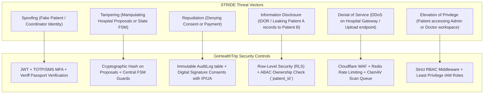
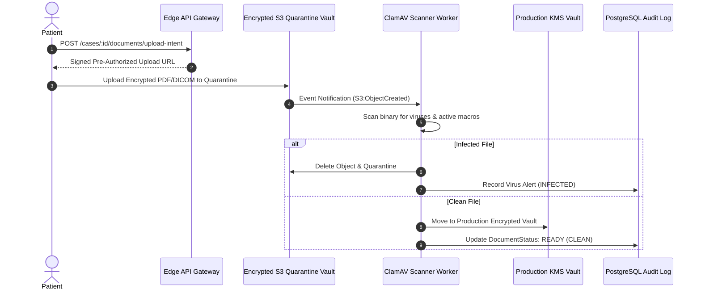

# Security Review, Threat Model & Compliance Architecture — GoHealthTrip

## 1. Executive Summary & Security Posture

GoHealthTrip coordinates sensitive cross-border medical, identity, and financial transactions. This security framework implements **Zero-Trust Architecture (ZTA)**, **Defense-in-Depth**, and strict compliance with:
1. **India Digital Personal Data Protection (DPDP) Act 2023**
2. **National Digital Health Mission (ABDM) Data Security Guidelines**
3. **HIPAA Security & Privacy Rule Best Practices** (for international medical records)
4. **21 CFR Part 11 / GAMP-5** for electronic signature and immutable audit trails

---

## 2. Data Classification Matrix

| Classification Level | Data Types | Encryption at Rest | Encryption in Transit | Access Control | Retention Policy |
|---|---|---|---|---|---|
| **Level 4: Critical PHI / Medical Scans** | Diagnostic reports, Angiograms, Biopsies, Surgical notes, Discharge summaries | AES-256 (KMS Envelope) | TLS 1.3 / mTLS | ABAC (Strict Patient + Treating Doctor Only) | 7 Years post-treatment |
| **Level 3: Critical PII / National Identity** | Passport numbers, Bio pages, National IDs, Attendant visas | AES-256 + SHA-256 Hash | TLS 1.3 | ABAC (Patient + Visa Coordinator Only) | Duration of visa + 1 Year |
| **Level 2: Financial & Commercial** | Payment transactions, Bank details, Partner commissions, Invoices | AES-256 | TLS 1.3 | Finance Admin + Super Admin | 8 Years (Indian Tax Regulations) |
| **Level 1: Operational & Logistics** | Flight PNRs, Hotel booking refs, Driver phone, Airport transfer schedule | AES-256 | TLS 1.3 | Travel Coordinator + Patient | 2 Years |
| **Level 0: Public / Catalog** | Hospital profiles, Doctor bios, Specialty descriptions, Indicative price ranges | Standard DB storage | TLS 1.3 | Public Read | Indefinite |

---

## 3. STRIDE Threat Modeling & Mitigations



---

## 4. Insecure Direct Object Reference (IDOR) Safeguards

> [!IMPORTANT]
> **Strict Tenant & Patient Isolation Rule**:
> Direct entity lookups (e.g. `/api/v1/cases/[id]`, `/api/v1/cases/[id]/documents/[docId]`) **never** trust user-supplied IDs alone.
> Every request executes:
> ```typescript
> if (user.role === 'PATIENT' && entity.patientId !== user.patientId) {
>   recordSecurityAlert('UNAUTHORIZED_ACCESS_ATTEMPT', user, entityId);
>   return apiError('Forbidden', 'FORBIDDEN', 403);
> }
> ```

---

## 5. File Upload & Anti-Malware Pipeline



---

## 6. Incident Response & Breach Notification Protocol

In compliance with DPDP 2023 and CERT-In directives:
1. **Detection & Containment**: Automated token revocation upon abnormal IP jump or brute-force signature.
2. **Auditing**: Tamper-proof audit logs queried to establish exact blast radius.
3. **Notification**: Mandatory reporting to Data Protection Board of India (DPBI) and affected international patients within 72 hours.
