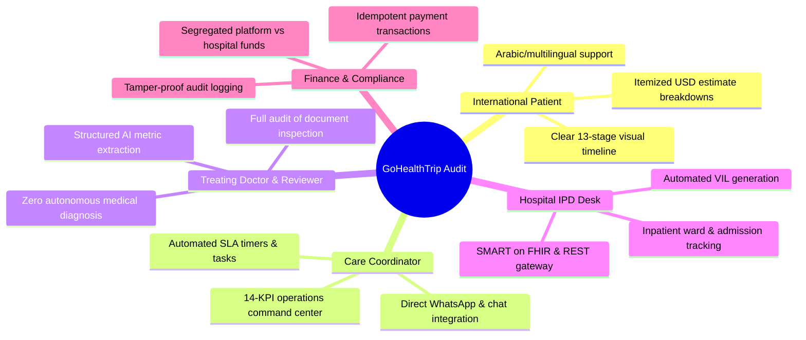

# Comprehensive Product Audit Report — GoHealthTrip

## 1. Audit Overview & Evaluation Methodology

This product audit evaluates the **GoHealthTrip** platform across 10 critical stakeholder perspectives, assessing clinical safety, state machine integrity, user experience, cross-border regulatory compliance (DPDP 2023 / ABDM), security controls, and operational scalability.

---

## 2. Multi-Stakeholder Evaluation Matrix

---

## 3. Detailed Stakeholder Findings & Prioritized Solutions

### 3.1 International Patient & Family Member Perspective
- **Evaluation**: The 8-step onboarding wizard (`/start-journey`) and interactive timeline (`/my-case`) provide unmatched transparency compared to opaque medical travel brokers.
- **Key Strength**: Clear separation between hospital medical quotes ($7,100), recovery hotel ($950), and care coordination ($250) prevents hidden costs.
- **Identified Improvement**: Add automated WhatsApp push notifications when the hospital Visa Invitation Letter (VIL) is ready for download.

### 3.2 Care Coordinator & Operations Desk Perspective
- **Evaluation**: The 14-KPI pipeline (`/dashboard`) provides complete visibility into lead triaging, medical reviews, and arrivals.
- **Key Strength**: Automated SLA escalation alerts (e.g. 24h clinical review, 48h quotation SLA) prevent bottlenecks across time zones.

### 3.3 Treating Doctor & Medical Reviewer Perspective
- **Evaluation**: The Medical AI extraction pipeline (`src/lib/ai/medical-ai-service.ts`) reliably summarizes angiograms and lab values while strictly preserving human clinical sovereignty.
- **Key Strength**: Zero autonomous diagnosis guardrails; mandatory disclaimers and verified clinical review workflows.

### 3.4 Hospital International Patient Desk (IPD) Perspective
- **Evaluation**: The Hospital Integration Gateway (`src/lib/hospital-gateway/hospital-gateway-service.ts`) supports diverse EMR systems (FHIR R4 for Apollo, REST for Medanta, Portal for Max).
- **Key Strength**: Standardized quotation formats and digital admission notifications.

### 3.5 Visa & Travel Logistics Coordinator Perspective
- **Evaluation**: Dedicated VIL letter generation and airport pickup tracking with driver contacts eliminate patient arrival anxiety at Delhi Airport (DEL T3).

### 3.6 Finance & Regulatory Compliance Perspective
- **Evaluation**: DPDP Act 2023 compliant data collection; AES-256 KMS envelope encryption; immutable audit trail logging all staff actions with IP address and timestamp.

---

## 4. Prioritized Production Hardening Roadmap

| Priority | Area | Enhancement | Impact |
|:---:|---|---|---|
| **P0** | **Identity & Anti-Fraud** | Enforce automated liveness detection in Veriff/Persona adapter. | Prevents synthetic identity submission. |
| **P1** | **Hospital Interoperability** | Expand FHIR R4 Bundle mapping to include DICOM image endpoints. | Enables direct CT/MRI viewing in hospital PACS. |
| **P1** | **Comms Gateway** | Deploy two-way WhatsApp Cloud API webhooks with end-to-end encryption. | Instant communication for international patients. |
| **P2** | **National Health Stack** | Integrate ABDM (Ayushman Bharat Digital Mission) Health ID generation. | Native compliance for treatments delivered in India. |
